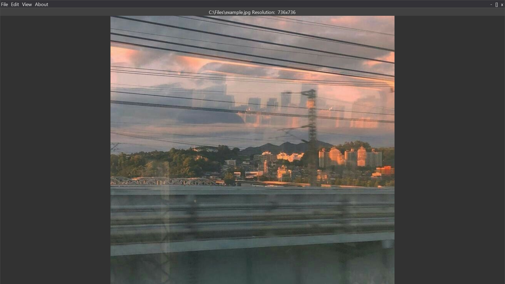

# RetroImageViewer
---

## Description

Simple image viewer created in python with [DearPyGui](https://github.com/hoffstadt/DearPyGui)
Currently supported only windows versions, however I'll add other systems support.
## Version
0.01a
