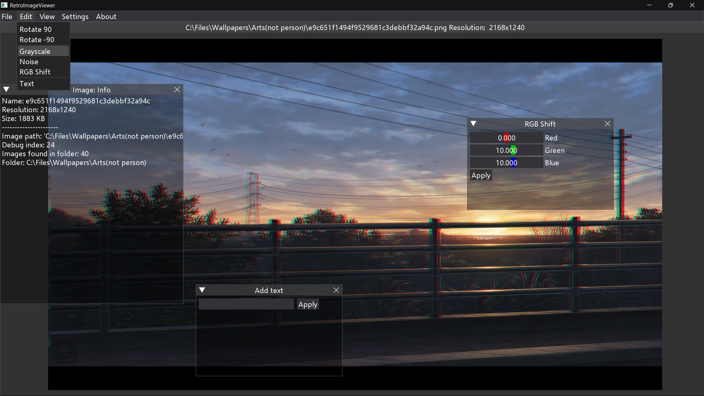

# RetroImageViewer
---

---

## Description

Simple image viewer created in python with [DearPyGUI](https://github.com/hoffstadt/DearPyGui).
It will also contain some image processing features.
Currently supported only windows versions, however I'll add other systems support.
## Version
0.085a - Basic viewing functions and a few image processing items.
